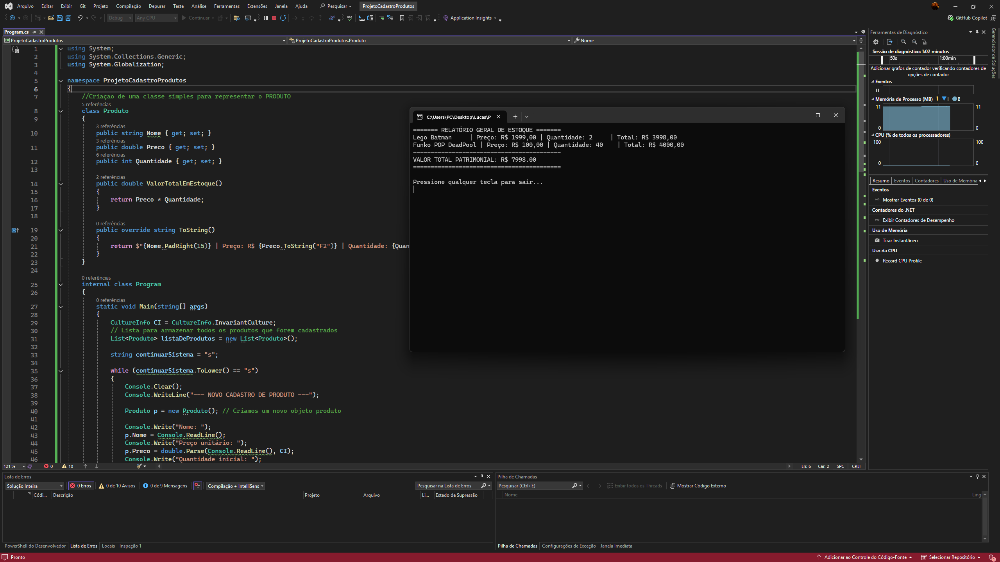

# 📦 Sistema de Gestão de Estoque (Console)

Este projeto é uma aplicação de terminal desenvolvida em C# para gerenciar o estoque de produtos. Ele permite cadastrar múltiplos itens, realizar entradas e saídas de mercadorias e gerar um relatório patrimonial completo.

Este projeto foi desenvolvido como parte dos meus estudos de lógica de programação e C#.

## 🚀 Funcionalidades

- **Cadastro de Produtos:** Nome, preço e quantidade inicial.
- **Gestão de Inventário:** Menu interativo para adicionar ou remover unidades.
- **Validação de Saldo:** Impede a saída de mercadorias caso não haja estoque suficiente.
- **Relatório Consolidado:** Ao final, o sistema exibe uma lista de todos os produtos cadastrados e o valor total investido no estoque.



## 🛠️ Tecnologias Utilizadas

- **Linguagem:** C#
- **Plataforma:** .NET
- **Conceitos aplicados:**
  - Variáveis e tipos de dados (`string`, `double`, `int`).
  - Estruturas condicionais (`if/else`).
  - Laços de repetição (`while` e `foreach`).
  - Coleções (`List<T>`).
  - Programação Orientada a Objetos (Classes e Métodos).

## 📋 Como executar

1. Certifique-se de ter o [.NET SDK](https://dotnet.microsoft.com/download) instalado em sua máquina.
2. Clone este repositório:
   ```bash
   git clone https://github.com/lucasffarias95/GerenciadorEstoqueCS.git
   ```
Navegue até a pasta do projeto:

```bash

cd GerenciadorEstoqueCS

```
Execute a aplicação:

```bash

dotnet run

```

🧠 Aprendizados
Durante o desenvolvimento deste projeto, evoluí de uma lógica sequencial simples para uma estrutura baseada em objetos e listas. Aprendi a importância de manter um código organizado para facilitar a manutenção e a experiência do usuário.

Desenvolvido por Lucas de Freitas Farias